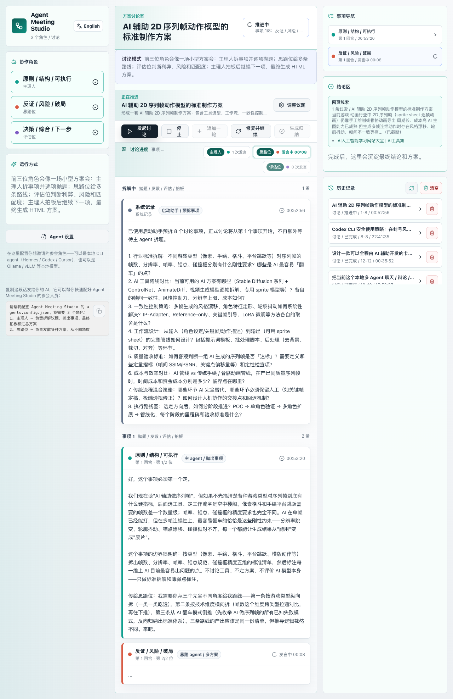
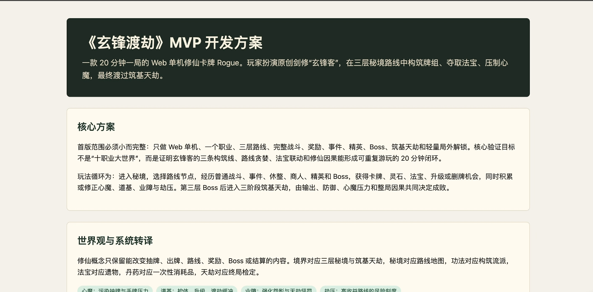

# Agent Meeting Studio

本地多 agent 辩论 / 讨论工具。你输入一个辩题、思路或方案，选择几个本地 agent，它们按真实 CLI 顺序调用，并把过程保存成可复盘会话。


主界面默认中文，右上角可以切换 English，方便公开发布后给英文用户使用。

## 两种模式

### 辩论模式

辩论模式固定使用选中的前三个 participant agent：

1. 第一个是主 agent：先把议题拆成若干辩点，设定每个辩点的正方立场、反方立场和裁决标准。
2. 第二个是正方辩手：只能为正方立场做最强辩护。
3. 第三个是反方辩手：只能为反方立场做最强辩护。

每个辩点按类似辩论赛的节奏推进：主 agent 开题 -> 正方立论 -> 反方立论 -> 正方反驳 -> 反方反驳 -> 主 agent 阶段裁决。所有辩点结束后，主 agent 输出最终裁决。

内部提示会要求 agent 按主题、对方真实回答、自己的立场、网络线索和最终目标仔细思考；但对外输出要重新组织成自然语言，不走机械表格和固定模板。

### 讨论模式

讨论模式固定使用选中的前三个 participant agent：

1. 第一个是主 agent：先把用户输入的事拆成若干事项；每个事项开始时抛题；收到发散和评估后负责判断并选择方案；最后汇总 HTML 文档。
2. 第二个是思路 agent：针对当前事项提供多种不同方案。
3. 第三个是评估 agent：分析各种方案的利弊、风险和与主题的契合度。

流程是：主 agent 拆题 -> 逐个事项推进 -> 思路 agent 发散 -> 评估 agent 分析 -> 主 agent 拍板 -> 下一个事项 -> 主 agent 输出最终 HTML 方案文档。讨论模式里的"最多回合"会被解释为"最多事项"。

最终 HTML 会同时提供三类定位信息：

- 浏览器访问地址：`http://127.0.0.1:5177/api/sessions/<session-id>/document`
- 独立 HTML 文件：`data/exports/<session-id>.html`
- 原始会话数据：`data/sessions/<session-id>.json`

页面结果区会直接显示这些路径，并提供复制按钮。

## 运行

```bash
npm install
cp agents.config.example.json agents.config.json
npm start          # 启动服务 + 自动打开浏览器
```

你也可以分步操作：

```bash
npm run server     # 仅启动后端（端口 8787）
npm run open       # 在浏览器中打开 http://127.0.0.1:8787
npm run dev        # 开发模式（前端热更新 5177 + 后端 8787）
```

开发模式前端默认在 `http://127.0.0.1:5177`，后端默认在 `http://127.0.0.1:8787`。生产构建后直接打开 `http://127.0.0.1:8787`。

## 接入本地 agent / 本地模型

编辑 `agents.config.json`。这个文件是你的本地私有配置，默认被 `.gitignore` 排除，不应该提交到 GitHub。

主界面优先展示 agent 的定位字段，比如 `title`、`role`、`stance`，而不是后端来源品牌。真实后端来源只保留在配置里，例如 `mode: "command"`、`mode: "openai-compatible"`、`command`、`model`。

### 方式一：接入 OpenAI-compatible 本地模型

推荐给公开发布的用户。Ollama、LM Studio、vLLM、llama.cpp server 等只要提供 OpenAI-compatible `/chat/completions` 接口，就可以用 `openai-compatible` 模式。

Ollama 示例：

```bash
ollama pull qwen2.5:7b
ollama pull llama3.1:8b
ollama pull mistral:7b
ollama serve
```

`agents.config.json` 示例：

```json
{
  "id": "local-main",
  "name": "Local 主理人",
  "title": "拆题 / 结构 / 拍板",
  "mode": "openai-compatible",
  "enabled": true,
  "color": "#0f9f8f",
  "stance": "你负责把问题拆清楚，建立判断标准，并在讨论模式中做最终选择。",
  "mission": "在辩论模式中负责拆题、设定正反方和裁决；在讨论模式中负责拆题、抛出事项、拍板和生成最终方案。",
  "baseUrl": "http://127.0.0.1:11434/v1",
  "model": "qwen2.5:7b",
  "apiKeyEnv": "",
  "temperature": 0.4,
  "maxTokens": 4096,
  "timeoutMs": 180000
}
```

如果你的本地网关需要 API key，不要把 key 写进 JSON。写环境变量名：

```json
{
  "mode": "openai-compatible",
  "baseUrl": "http://127.0.0.1:1234/v1",
  "model": "local-model-name",
  "apiKeyEnv": "LOCAL_MODEL_API_KEY"
}
```

然后在 `.env` 或 shell 里设置：

```bash
export LOCAL_MODEL_API_KEY="你的 key"
```

### 方式二：接入 CLI agent

如果你已经有 Codex、Hermes、Cursor、Claude Code 或自己的 shell wrapper，可以用 `command` 模式。

例如接入三个真实命令型 agent：

- 架构派：定义问题、约束、路径和验收标准。
- 反方派：强反驳、找失败模式和替代推进方式。
- 收敛派：把冲突压缩成决策、实验或下一步动作。

接入真实 CLI 时使用 `command` 模式：

```json
{
  "id": "hermes-strategist",
  "name": "Hermes 策略师",
  "mode": "command",
  "enabled": true,
  "stance": "你负责从战略、路径和资源取舍角度参与辩论。",
  "mission": "回应上一位真实回答，并推进主题。",
  "command": "hermes",
  "args": ["-z", "{{prompt}}", "--provider", "deepseek", "--model", "deepseek-v4-pro", "--ignore-rules"],
  "timeoutMs": 180000
}
```

Codex 这类需要把最终回答写入文件的 CLI 可以用：

```json
{
  "command": "codex",
  "args": ["exec", "--output-last-message", "{{outputFile}}", "{{prompt}}"],
  "stdoutMode": "ignore",
  "outputFile": true
}
```

模板变量：

- `{{prompt}}`: 完整 agent 提示词。
- `{{topic}}`: 当前议题。
- `{{context}}`: 用户补充背景。
- `{{goal}}`: 期望结果。
- `{{round}}`: 当前回合。
- `{{outputFile}}`: 临时输出文件路径，适用于 Codex `--output-last-message`。

如果你的 agent 从 stdin 读取输入，设置 `"stdin": "{{prompt}}"`。

## 网络检索

`research.enabled` 开启时，后端会在会话开始前用 Bing RSS 检索主题相关公开信息，把标题、摘要和链接放进每个 agent 的提示词里。agent 必须说明使用了哪些线索，或说明为什么本轮不依赖外部信息。

## 案例展示



*三个 CLI agent（架构 / 反方 / 收敛）围绕技术方案进行多轮辩论，实时输出会话记录。*

---

# Agent Meeting Studio (English)

A local-first, multi-agent debate and discussion tool. Bring your own agents — CLI-based (Hermes, Codex, Cursor) or local models (Ollama, vLLM, LM Studio) — and run structured debates or brainstorming sessions with full session replay.


The UI defaults to Chinese. Click **English** in the top-right corner to switch.

## Two Modes

### Debate Mode

Debate mode always uses the first three selected participant agents:

1. **Moderator Agent** — breaks the topic into debate points, defines pro/con stances and judging criteria for each.
2. **Pro Debater** — defends the pro position with the strongest arguments.
3. **Con Debater** — defends the con position, only attacking the pro side.

Each debate point follows a structured flow: moderator opens → pro opening → con opening → pro rebuttal → con rebuttal → moderator ruling. After all points, the moderator delivers the final verdict.

Internal prompts require agents to reason deeply about the topic, opponents' actual responses, their assigned stance, web research clues, and the end goal — but external output must be restructured into natural language, never rigid tables or templates.

### Discussion Mode

Discussion mode always uses the first three selected participant agents:

1. **Moderator Agent** — breaks the user's input into agenda items; kicks off each item; evaluates proposals and picks a direction; produces a final HTML plan.
2. **Ideation Agent** — generates diverse approaches for the current agenda item.
3. **Evaluation Agent** — analyzes trade-offs, risks, and alignment with the topic.

Flow: moderator breaks down topic → iterate through items → ideation agent diverges → evaluation agent analyzes → moderator decides → next item → moderator outputs final HTML document. The "max rounds" setting is interpreted as "max agenda items" in discussion mode.

The final HTML is accessible in three ways:

- Browser URL: `http://127.0.0.1:5177/api/sessions/<session-id>/document`
- Standalone HTML file: `data/exports/<session-id>.html`
- Raw session data: `data/sessions/<session-id>.json`

The result panel displays these paths with copy buttons.

## Getting Started

```bash
npm install
cp agents.config.example.json agents.config.json
npm start          # starts server + opens browser
```

Step-by-step alternative:

```bash
npm run server     # backend only (port 8787)
npm run open       # opens http://127.0.0.1:8787 in browser
npm run dev        # dev mode (Vite HMR on 5177 + backend on 8787)
```

In dev mode, the frontend runs at `http://127.0.0.1:5177`, backend at `http://127.0.0.1:8787`. After production build, open `http://127.0.0.1:8787` directly.

## Connecting Your Agents / Models

Edit `agents.config.json`. This is your private local configuration — it's excluded by `.gitignore` and should never be committed to GitHub.

The UI shows agent positioning fields (`title`, `role`, `stance`) rather than backend brands. The actual backend details stay in your config: `mode`, `command`, `model`, `baseUrl`.

### Option 1: OpenAI-compatible Local Models

Recommended for public deployment. Ollama, LM Studio, vLLM, llama.cpp server — anything that exposes an OpenAI-compatible `/chat/completions` endpoint — works via the `openai-compatible` mode.

Ollama quickstart:

```bash
ollama pull qwen2.5:7b
ollama pull llama3.1:8b
ollama pull mistral:7b
ollama serve
```

Example `agents.config.json` entry:

```json
{
  "id": "local-main",
  "name": "Local Moderator",
  "title": "Breakdown / Structure / Decide",
  "mode": "openai-compatible",
  "enabled": true,
  "color": "#0f9f8f",
  "stance": "Break down problems clearly, establish evaluation criteria, and make final decisions in discussion mode.",
  "mission": "In debate mode: decompose topics, set pro/con stances, and judge. In discussion mode: break down agenda, raise items, decide, and produce final plan.",
  "baseUrl": "http://127.0.0.1:11434/v1",
  "model": "qwen2.5:7b",
  "apiKeyEnv": "",
  "temperature": 0.4,
  "maxTokens": 4096,
  "timeoutMs": 180000
}
```

If your local gateway requires an API key, use an environment variable reference instead of hardcoding:

```json
{
  "mode": "openai-compatible",
  "baseUrl": "http://127.0.0.1:1234/v1",
  "model": "local-model-name",
  "apiKeyEnv": "LOCAL_MODEL_API_KEY"
}
```

Then set it in `.env` or your shell:

```bash
export LOCAL_MODEL_API_KEY="your-key"
```

### Option 2: CLI Agents

If you already have Codex, Hermes, Cursor, Claude Code, or your own shell wrapper, use `command` mode.

Example: three CLI agents forming a debate panel:

- **Architect** — defines problems, constraints, paths, and acceptance criteria.
- **Devil's Advocate** — challenges assumptions, finds failure modes, proposes alternatives.
- **Converger** — compresses conflict into decisions, experiments, or next actions.

CLI agent config using `command` mode:

```json
{
  "id": "hermes-strategist",
  "name": "Hermes Strategist",
  "mode": "command",
  "enabled": true,
  "stance": "Participate in debates from a strategy, roadmap, and resource trade-off perspective.",
  "mission": "Respond to the previous agent's actual reply and advance the topic.",
  "command": "hermes",
  "args": ["-z", "{{prompt}}", "--provider", "deepseek", "--model", "deepseek-v4-pro", "--ignore-rules"],
  "timeoutMs": 180000
}
```

For CLIs like Codex that write the final response to a file:

```json
{
  "command": "codex",
  "args": ["exec", "--output-last-message", "{{outputFile}}", "{{prompt}}"],
  "stdoutMode": "ignore",
  "outputFile": true
}
```

Template variables:

- `{{prompt}}` — full agent prompt.
- `{{topic}}` — current topic.
- `{{context}}` — user-supplied background.
- `{{goal}}` — desired outcome.
- `{{round}}` — current round number.
- `{{outputFile}}` — temp file path, for CLIs like Codex `--output-last-message`.

If your agent reads from stdin, set `"stdin": "{{prompt}}"`.

## Web Research

When `research.enabled` is on, the backend fetches public information about the topic via Bing RSS before the session starts. Article titles, snippets, and URLs are injected into each agent's prompt. Agents must cite which clues they used — or explain why they didn't rely on external information this round.

## Case Study


*Three CLI agents (Architect / Devil's Advocate / Converger) running a multi-round technical debate with live session output.*
